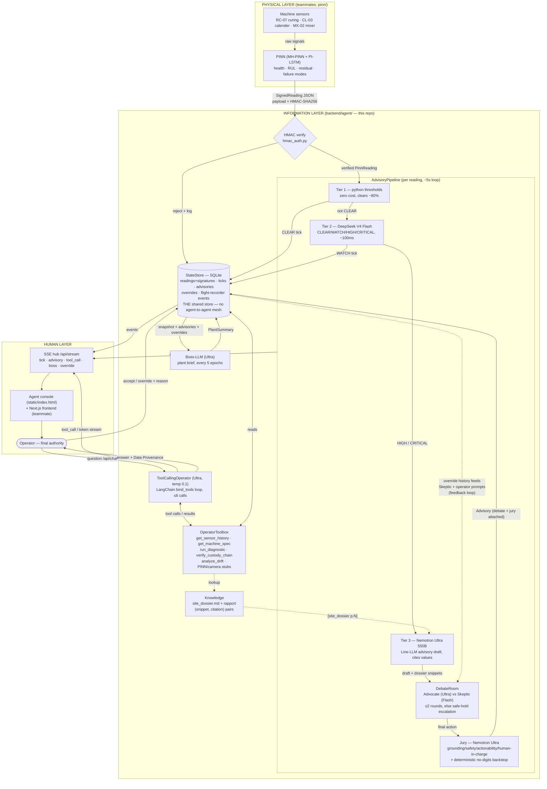

# PRAETOR — full-architecture dataflow

Where every byte goes, from physical sensor to human decision — and back.
Three trust boundaries: **HMAC** (physics → information), **Jury gate** (agent → human),
**Operator decision** (human → memory). Nothing crosses a boundary unverified.

## 1. End-to-end flow

## 2. Hop-by-hop

| # | From → To | Payload | Transport | Trigger |
|---|---|---|---|---|
| 1 | Sensors → PINN | raw signals | in-process (pinn/) | continuous |
| 2 | PINN → EdgeVerify | `SignedReading{payload, hmac_sha256}` | JSON (today: TelemetrySource replay of C-MAPSS/AI4I) | each epoch (~5 s) |
| 3 | Verify → Pipeline | `PinnReading` | in-process | HMAC valid — else reject event → store |
| 4 | Tier1 → Tier2 | telemetry digest (text) | Crusoe API, DeepSeek V4 Flash | envelope breached |
| 5 | Tier2 → Tier3 | digest + causal matrix + dossier snippets | Crusoe API, Nemotron Ultra | HIGH/CRITICAL |
| 6 | Tier3 → Debate | `AdvisoryDraft` | Crusoe API ×2-4 (Advocate Ultra / Skeptic Flash) | every draft |
| 7 | Debate → Jury | final advisory text + digest | Crusoe API, Ultra (JSON schema) | every advisory, incl. escalated |
| 8 | Jury → Store | `Advisory{debate, jury, status:pending}` | SQLite upsert | always |
| 9 | Store → SSE hub → UIs | every event kind | Server-Sent Events | on publish |
| 10 | Operator → Chat agent | question | POST /api/chat (SSE) | on demand |
| 11 | Chat agent ⇄ Toolbox | tool calls: history/spec/diagnostic/custody/drift | in-process (tools read store/knowledge) | model decides, ≤6 |
| 12 | Chat agent → Operator | answer + programmatic **Data Provenance** | SSE tokens → `turn` | end of loop |
| 13 | Operator → Store | accept / override + reason | POST /api/advisory/{id}/* | human call |
| 14 | Store → future prompts | override history | injected into Skeptic + operator context | next epochs |
| 15 | Store → Boss-LLM → hub | snapshot → `PlantSummary` | Crusoe API, Ultra | every 5 epochs |

## 3. Mode switch

Same code both modes. No `CRUSOE_API_KEY` (or `MOCK_LLM=1`) → deterministic MockClient
(tools still run for real against the local store). Key present → live Crusoe
(`https://api.inference.crusoecloud.com/v1/`); any live failure degrades per-call to mock
instead of crashing the loop. Validate live with `python scripts/crusoe_sanity.py`.

## 4. Ports & processes

One FastAPI process (`uvicorn backend.agent.main:app`, :8000) hosts loop + pipeline +
SSE hub + chat agent + console. Next.js (:3000) consumes the same API (CORS open).
SQLite file `backend/agent/praetor_state.db` is the only shared state — any process
(e.g. a diagnostics CLI) can point at it later, which is exactly the architecture's
"write to a shared store, never point-to-point" rule.
