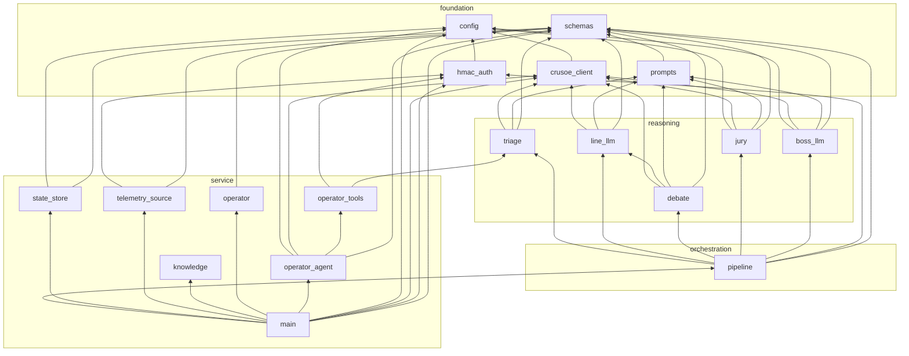

# Repo model — Crusoe (PRAETOR)

One page to navigate the whole repository: what each file is, which layer it
belongs to, and who imports whom (extracted from the AST, not guessed).
Companion: `docs/DATAFLOW.md` (runtime flow), `docs/LLM_LAYER_README.md` (architecture).

## 1. Layout by layer

```
Crusoe/
├── README.md                     team scaffold (project brief)
├── docs/
│   ├── claude-code-prompt-data-exploration.md   team: data exploration prompt
│   ├── CRUSOE.md                 Crusoe Managed Inference API reference (workshop skill file)
│   ├── DATAFLOW.md               runtime dataflow + trust boundaries (mermaid)
│   ├── LLM_LAYER_README.md       information-layer architecture & mapping
│   ├── PR_BODY_LLM_LAYER.md      PR description for this branch
│   └── REPO_MAP.md               this file
│
├── pinn/                         ── PHYSICAL LAYER (teammates) ──
│   ├── PINN_architecture-project-crusoe.md      MH-PINN + PI-LSTM design doc
│   └── data/                     C-MAPSS FD001 + AI4I 2020 (public benchmarks)
│
├── backend/
│   ├── requirements.txt          fastapi · uvicorn · openai · pydantic · dotenv · langchain-openai/core
│   ├── api/                      (reserved)
│   └── agent/                    ── INFORMATION LAYER (this branch) ──
│       │                            foundation
│       ├── config.py        91   env/.env, model registry, mock detection
│       ├── schemas.py      157   ALL data contracts (pydantic)
│       ├── hmac_auth.py     35   HMAC-SHA256 sign/verify (physical→info boundary)
│       ├── crusoe_client.py 332  LLM client: live Crusoe / deterministic mock, JSON repair, 412 retry
│       ├── prompts.py      229   every prompt template
│       │                            reasoning (background pipeline)
│       ├── triage.py       191   Tier1 thresholds + Tier2 Flash classify + causal matrix
│       ├── line_llm.py     132   Tier3 advisory draft (Ultra, cites values)
│       ├── debate.py        98   Advocate vs Skeptic, ≤2 rounds, safe-hold escalation
│       ├── jury.py          53   LLM-as-judge gate + no-digits backstop
│       ├── boss_llm.py      64   plant brief (reads store only)
│       ├── pipeline.py     173   orchestrator: verify→triage→advise→debate→jury→store
│       │                            service (on-demand + transport)
│       ├── state_store.py  321   shared SQLite: readings+signatures, ticks, advisories, overrides, events
│       ├── telemetry_source.py 224  PINN stand-in: replays datasets as SignedReading (HMAC)
│       ├── knowledge.py    190   Michelin dossier chunks with [site_dossier p.N] citations
│       ├── operator.py     170   legacy gather-then-answer agent + override handler
│       ├── operator_tools.py 495 the 7 tools (5 real + 2 stubs), auditable results
│       ├── operator_agent.py 466 tool-calling chatbot (LangChain bind_tools, Data Provenance)
│       ├── main.py         425   FastAPI app: loop, SSE hub, chat, overrides, boss
│       ├── static/index.html     agent console (single file, no CDN)
│       ├── knowledge/            extracted case texts (site dossier, rapport)
│       └── tests/                3 suites, offline: pipeline · service (14) · operator (12)
│
├── scripts/
│   ├── crusoe_latency_test.py    model latency benchmark (TTFT/tok·s)
│   ├── crusoe_sanity.py          live checks: models on key, both tiers, tool-call probe
│   └── push_llm_to_team.sh       (historical) branch+graft+push helper
└── frontend/                     (reserved — Next.js teammate)
```

## 2. Module dependency graph (backend/agent, from AST)

Arrows point at what a module imports. Four strict strata — imports only flow
downward, no cycles:



Notable edges: `debate → line_llm` (the Advocate defends the Line-LLM's draft);
`operator_tools → triage` (reuses the causal matrix for `get_machine_spec`);
`main → pipeline` is `try/except` — the service boots and demos even if the
reasoning stack is broken (triage-echo degraded mode).

## 3. Data contracts (schemas.py — the API between all parts)

| Contract | Producer → Consumer |
|---|---|
| `SignedReading{payload, signature}` | PINN (or telemetry_source) → pipeline. **The PINN team implements exactly this.** |
| `PinnReading{signals, pinn:{health, rul, residual, modes}}` | inside payload |
| `TriageResult` / `DebateResult` / `JuryScore` | pipeline internals → store, SSE |
| `Advisory{message, justification, eur_impact, debate, jury, status}` | pipeline → store → console/frontend |
| `OperatorOverride{decision, reason}` | operator → store → future prompts |
| `OperatorTurn + provenance[]` | operator_agent → /api/chat |
| `PlantSummary` | boss_llm → /api/plant, SSE |

## 4. HTTP/SSE surface (main.py)

`GET /` console · `GET /api/health` · `POST /api/loop/start|stop` ·
`GET /api/stream` (SSE: hello/tick/advisory/boss/override/tool_call/tool_result) ·
`GET /api/advisories` · `POST /api/advisory/{id}/accept|override` ·
`POST /api/chat` (SSE: tool_call/tool_result/token/turn/done — or JSON) ·
`GET /api/plant`. CORS open to :3000.

## 5. Test map

| Suite | Covers |
|---|---|
| `test_pipeline_mock.py` | HMAC reject, tier routing, debate transcript, jury attach, boss, flight-recorder events |
| `test_service_mock.py` (14) | store round-trips, telemetry determinism+arc, knowledge citations+gaps, chat citations, snapshot |
| `test_operator_agent_mock.py` (12) | real tool outputs, custody tamper detection (named link), drift, stubs, provenance, SSE ordering |

All offline (`MOCK_LLM=1`); live validation: `python scripts/crusoe_sanity.py`.
